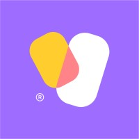
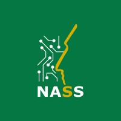

 

<h3 align="center">"Make it work, make it right, make it fast."</h3>
<h4 align="center">- Kent Beck -</h4>

 

 
 

 

 

## Language and Tools

#### Main Stack:

[]

#### Tools & Workflow:

[]

#### Familiar with:

[]

 

## Professional Experience

[]
**Junior Software Engineer — Yamm** \
`Go` `PostgreSQL` `Redis` `Docker` `REST APIs` `RBAC` `Subscriptions` `Payment Integrations` `Background Jobs` \
Full-time · Remote · Mar 2026 – Present\
Multi-tenant e-commerce backend: refund workflows, localization, shipping/payment integrations, subscription management, structured logging.

 

[]
**Programming Teacher — WE School of Technology** \
`PHP` `Laravel` `React` \
Full-time · Sep 2025 – Feb 2026\
Full-stack programming instructor covering web development and fundamentals.

 

## Academic Background:

**Computer and Control Engineering — B.Sc.** \
[**Suez Canal University**](https://suez.edu.eg/ar/en/%D9%83%D9%84%D9%8A%D8%A9-%D8%A7%D9%84%D9%87%D9%86%D8%AF%D8%B3%D8%A9/) • Graduated with Excellent with Honor · CGPA 3.73/4.0 · Rank 2nd\
Skills: `Go` `PostgreSQL` `REST APIs` `Docker` `Redis` `Authentication & Authorization` `RBAC` `System Design`

 

**Graduation Project — Post Accident System (PAS)** \
Award-winning cloud backend for post-accident vehicle assistance: `Go` `HTTP/MQTT API` `PostgreSQL` `JWT` `MQTT` \
🥇 1st Place — 7th Annual Research Conference, Suez Canal University \
🥇 1st Place — Microsoft Student Club SCU · AI Startups Competition

 

## Student Activity:

**Head of Backend at Microsoft Student Club SCU** \
[**Microsoft Student Club SCU**](https://m.facebook.com/MicrosoftSCU/) • In progress\
Skills: `API Development` `Databases` `Authentication and Authorization` `WebSockets` `gRPC`

 

**Technical Member of IEEE SCU Backend team** \
[**IEEE SCU**](https://www.facebook.com/@IEEESCU/) • In progress\
Skills: `API Development` `Databases` `Authentication and Authorization` `WebSockets` `gRPC`

 

**Member of ICPC SCU team** \
[**ICPC SCU**](https://icpc-scu-official-website.me/) • 2022 - 2024\
Skills: `Problem Solving` `Competitive Programming` `Data Structures and Algorithms` `C/C++`

 

**Dashboard Member of SCU Racing Team** \
[**SCU Racing Team**](https://www.facebook.com/SCURacingTeam) • In progress\
Skills: `Problem Solving` `Arduino C` `Embedded Systems`
 

## Contact me:

   
   

